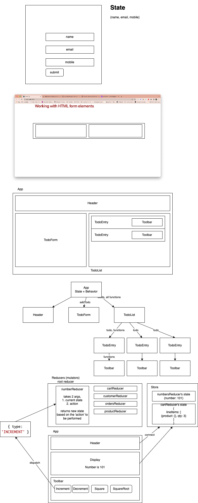

# React/TypeScript training

### Sequence of examples:

1. [react-basics](./react-basics/)
1. [react-form-basics](./react-form-basics/)
1. [react-todo-app](./react-todo-app/)
1. [rest-server](./rest-server/)
1. [react-hoc-demo](./react-hoc-demo/)
1. [react-redux-numbers-app](./react-redux-numbers-app/)
1. [react-redux-shopping-app](./react-redux-shopping-app/)
1. [vinbasket](./vinbasket/)
1. [react-redux-toolkit-addressbook-app](./react-redux-toolkit-addressbook-app/)
1. [react-redux-saga-customers-app](./react-redux-saga-customers-app/)
1. [react-hooks-demo](./react-hooks-demo/)
1. [react-redux-todo-testing-demo](./react-redux-todo-testing-demo/)



```sh

npx create-react-app react-basics --template typescript

```

## Steps to setup a local rest endpoint (api)

1. create directory `rest-server`
2. run the cmd `npm init -y` inside the `rest-server` folder
    - this creates package.json
3. install the dependency `json-server`
    - `npm i json-server`
4. create a file called data/db.json
5. add a script entry in package.json
    - "start": "json-server --watch --port=4000 data/db.json"
6. run the cmd `npm start`
7. access the api at http://localhost:4000/products

## HOC

-   a function
-   takes a component as argument, and returns same/modified/new component

```js

const root_redcucer = combineReducers({
    numbersReducer,
    cartReducer,
    productReducer,
    //...
})

const store = create_store(root_reducer);


// example action:

{ type: 'INCREMENT' }
{ type: 'DEL_CUSTOMER', payload: 1123 }
{ type: 'ADD_CUSTOMER', payload: {firstname: 'Vinod', lastname: 'Kumar', address: '', city: 'Bangalore'}}

```
